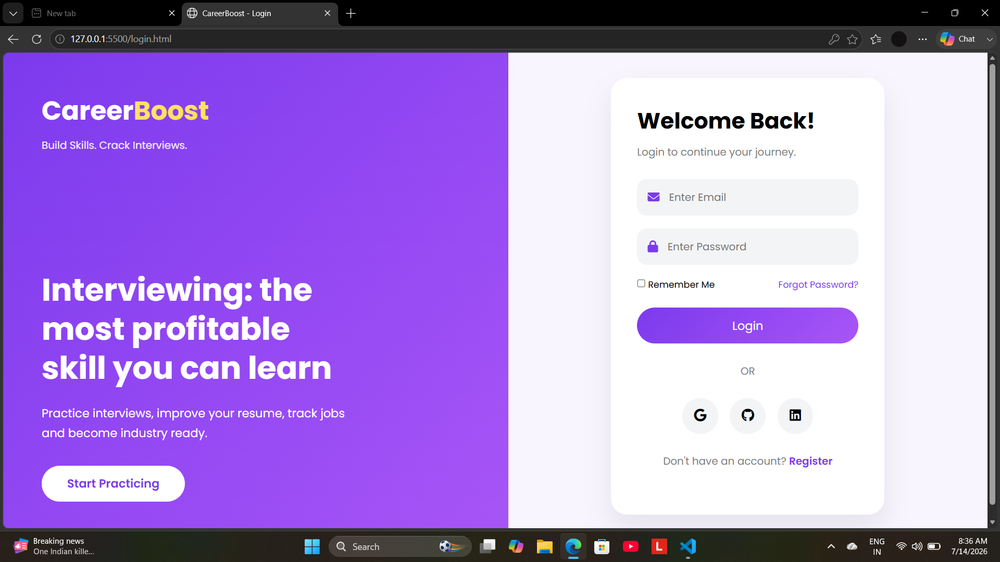
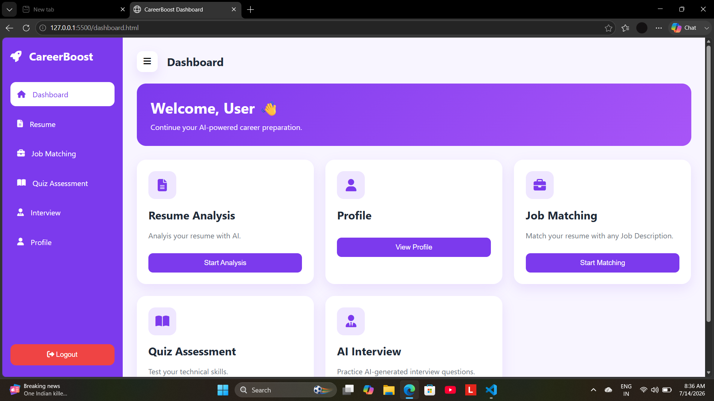
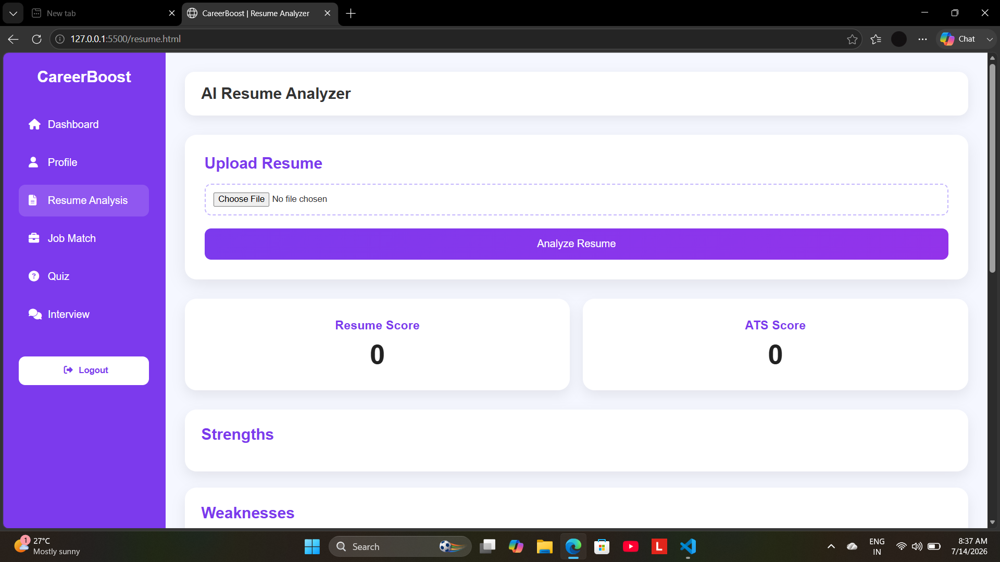
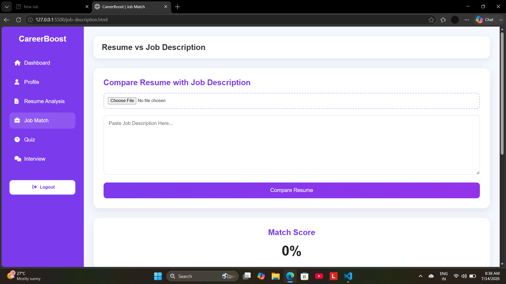
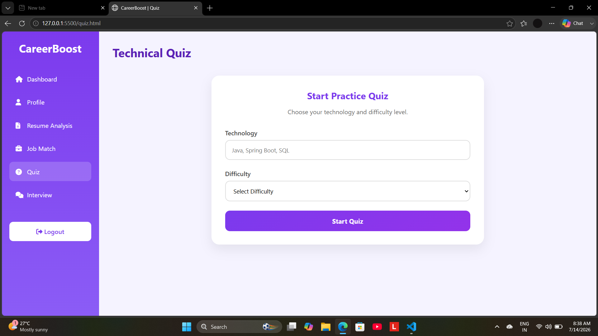
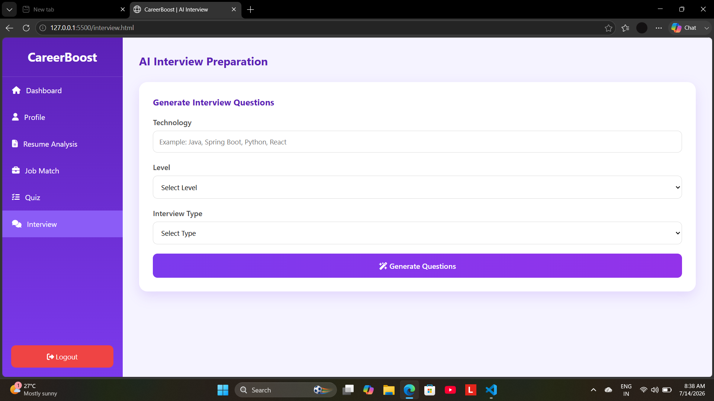

# 🚀 CareerBoost

> An AI-powered Career Preparation Platform that helps students and job seekers improve their resumes, compare them with job descriptions, practice AI interviews, and assess technical skills.

---

# 🌐 Live Demo

| Service | Link |
|----------|------|
| 🚀 Frontend (Netlify) | https://idyllic-pothos-75d196.netlify.app/|
| ⚙️ Backend API (Render) | https://careerboost-backend-zkdt.onrender.com|
| 🗄️ Database | Railway MySQL |

---

# 📌 Overview

CareerBoost is a Full Stack AI-powered web application developed using **Java 17**, **Spring Boot**, **Spring AI**, **MySQL**, and **Google Gemini 2.5 Flash API**.

The platform helps students and job seekers improve their resumes, compare resumes with job descriptions, practice technical interviews, and evaluate technical knowledge through quizzes.

---

# ✨ Features

## 🤖 AI Resume Analyzer

- Upload Resume (PDF)
- AI Resume Analysis
- Resume Score
- ATS Score
- Strengths & Weaknesses
- Missing Skills Detection
- Keyword Analysis
- ATS Improvement Suggestions
- Project Suggestions
- Interview Tips
- Personalized Learning Roadmap

---

## 💼 Resume vs Job Description

- Upload Resume
- Paste Job Description
- AI Match Score
- Matched Skills
- Missing Skills
- Missing Keywords
- Keyword Suggestions
- Resume Improvement Suggestions

---

## 👤 User Module

- User Registration
- User Login
- User Profile
- Dashboard

---

## 📝 Technical Quiz

- Technology-wise Quiz
- Difficulty Selection
- MCQ Practice
- Automatic Score Calculation
- Performance Analysis

---

## 🎤 AI Interview Preparation

- AI-generated Interview Questions
- Technology-based Questions
- Difficulty Levels
- Interview Practice

---

# 🛠 Tech Stack

## Backend

- Java 17
- Spring Boot
- Spring AI
- Spring Data JPA
- REST APIs
- Maven

---

## Frontend

- HTML5
- CSS3
- JavaScript

---

## Database

- MySQL (Railway)

---

## AI

- Google Gemini 2.5 Flash API

---

## Deployment

- Netlify (Frontend)
- Render (Backend)
- Railway (Database)

---

## Tools

- IntelliJ IDEA
- VS Code
- Git
- GitHub
- Postman

---

# 📂 Project Structure

```text
CareerBoost
│
├── frontend
│   ├── css
│   ├── js
│   ├── login.html
│   ├── dashboard.html
│   ├── resume.html
│   ├── job-description.html
│   ├── quiz.html
│   ├── interview.html
│   └── profile.html
│
├── src
│   ├── controller
│   ├── service
│   ├── repository
│   ├── entity
│   ├── dto
│   ├── config
│   └── resources
│
├── pom.xml
└── README.md
```

---

# ⚙️ Installation

## Clone Repository

```bash
git clone https://github.com/ashvinibarode/CareerBoost.git
```

Open the project in IntelliJ IDEA.

---

## Configure Database

Create MySQL Database

```sql
CREATE DATABASE careerboost_db;
```

Update `application.properties`

```properties
spring.datasource.url=jdbc:mysql://localhost:3306/careerboost_db
spring.datasource.username=YOUR_USERNAME
spring.datasource.password=YOUR_PASSWORD

spring.ai.google.genai.api-key=YOUR_GEMINI_API_KEY
```

---

## Run Backend

```bash
mvn spring-boot:run
```

Backend will start on

```
http://localhost:8080
```

---

## Run Frontend

Open

```
frontend/login.html
```

or use Live Server in VS Code.

---

# 🔗 REST APIs

| Method | Endpoint | Description |
|---------|----------|-------------|
| POST | `/auth/register` | Register User |
| POST | `/auth/login` | User Login |
| GET | `/dashboard/{userId}` | Dashboard |
| GET | `/profile/{userId}` | User Profile |
| PUT | `/profile/update` | Update Profile |
| POST | `/ai/resume/pdf` | Resume Analysis |
| POST | `/jd/analyze` | Resume vs Job Description |
| GET | `/quiz/{technology}` | Get Quiz |
| POST | `/quiz/submit` | Submit Quiz |
| POST | `/interview` | AI Interview Questions |

---

# ☁️ Deployment

| Service | Platform |
|----------|----------|
| Frontend | Netlify |
| Backend | Render |
| Database | Railway MySQL |

---

# 📸 Screenshots

## Login



---

## Dashboard



---

## Resume Analyzer



---

## Resume vs Job Description



---

## Technical Quiz



---

## AI Interview



---

# 🚀 Future Improvements

- JWT Authentication
- Resume Builder
- Resume Download (PDF)
- Admin Dashboard
- Email Notifications
- Docker Support
- Dark Mode
- Multi-language Support

---

# 👨‍💻 Author

**Ashvini Barode**

🎓 MCA Student

💻 Java Full Stack Developer

🤖 Spring Boot | Spring AI | REST APIs | MySQL

---

## ⭐ Support

If you found this project useful, please consider giving it a **Star ⭐** on GitHub.
